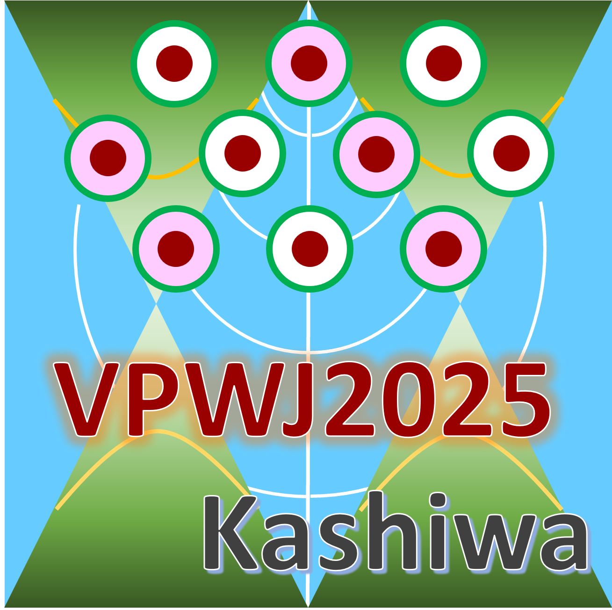

# 第31回渦糸物理ワークショップ (31th Vortex Physics Workshop Japan)

## 日時：2025年12月15日(月)-17日(水)　
## 場所：東京大学柏図書館メディアホール

## important date
- 参加登録締め切り：　2025年11月16日（日）24:00 JST [参加登録フォーム](https://docs.google.com/forms/d/1pG6pk4pT4WGUvN_ddPde7NRCp3hZJRJQO19rGuMdYAI/edit?hl=ja)
- 概要投稿締め切り：　~~2025年11月30日（日）24:00 JST~~ 2025年12月3日（水）24:00 JST **延長しました** [概要投稿フォーム](https://docs.google.com/forms/d/1urHdXq2qk4F6Xx3f_3hQOKH6Al8CwYZ-audOZwAmd3A)

概要テンプレートは[こちら](./vpwj2025_abstract.doc)。PDF形式にしてアップロードをお願いします。

## 概要
本ワークショップは、1992年から開催されてきた「渦糸物理国内会議」の伝統を引き継ぎつつ、2018年
の[ボルテックスフォーラム](https://sites.google.com/view/vortex-forum-japan/)発足以降、「渦糸物理ワークショップ」として装いを改めました。議論の対象
範囲を、超伝導・超流動・密度波周辺の様々な物理現象に広げ（例えば、下記を参照）、最新の研究
成果発表と活発な討論を通じ、今後の研究方向性について、分野の垣根を越えて互いに論じ合う場
を提供することを目指します。

## キーワード
磁束相図・磁束ダイナミクス、磁束ピニング、新規(奇)超伝
導/トポロジカル超伝導、トポロジカル欠陥関連、接合系・
量子デバイス・ジョセフソンプラズマ、ナノ・メゾスコピック超
伝導、準粒子励起、ヘリカル・FFLO・PDW超伝導、BCS-
BECクロスオーバー、超伝導光物性、超伝導非相反（超伝
導ダイオード）、超伝導・超流動・密度波の新奇現象

## 主催：渦糸物理ワークショップ実行委員会
- 永井佑紀（東京大学情報基盤センター）
- 野島勉（東北大学金属材料研究所）

## 参加費
- 一般（学生以外）：5000円
- 学生:無料

## 講演プログラム
[講演プログラム](VPWJprogram.pdf)

## 概要集
[概要集 (PDF)](VPWJ2025_abstracts.pdf)

共催：[ボルテックスフォーラム](https://sites.google.com/view/vortex-forum-japan/)